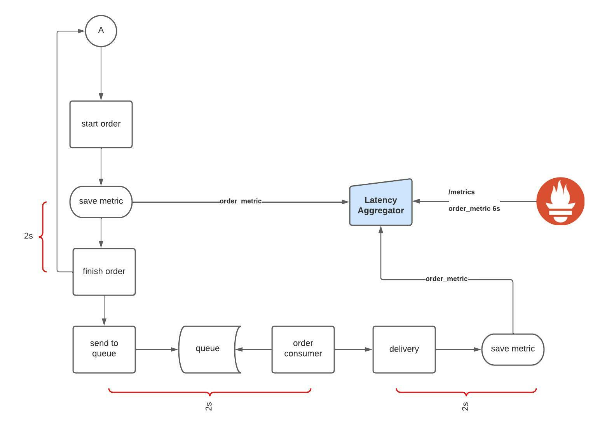

#  Latency Aggregator

Project to generate the real latency of a flow that goes through several services

*****

## Table of contents

1. [Docker](#docker)
2. [Development](#development)
3. [Running](#running)
4. [Directory structure](#directory-structure)
5. [How it works](#how-it-works)
6. [Example of use](#exemple-of-use)
7. [API](#api)

## Docker

```
    docker run -p 7070:7070 fsrg/latency-aggregator:0.0.1
```

## Development

- golang 1.17 ([site golang](https://golang.org/doc/install) or [asdf](https://github.com/kennyp/asdf-golang))

*****

## Running

### Without docker:

1. `docker-compose up -d`
2. `go run cmd/latency-aggregator/main.go` or use a `vscode` task


### With docker:

1. `make run-docker` (docker-compose + docker-compose.app)


## Directory structure

```bash
.
|____hooks
| |____pre-commit
|____cmd
| |____latency-aggregator
| | |____main.go
|____internal
| |____domain
| | |____aggregator
| |____infrastructure
| | |____api
| | |____collector
| | |____metric
| | |____database
|____docs
|____3rd
|______tools__


```

## /internal

Private application and library code. This is the code you don't want others importing in their applications or libraries. Note that this layout pattern is enforced by the Go compiler itself. See the Go 1.4 release notes for more details. Note that you are not limited to the top level internal directory. You can have more than one internal directory at any level of your project tree.

You can optionally add a bit of extra structure to your internal packages to separate your shared and non-shared internal code. It's not required (especially for smaller projects), but it's nice to have visual clues showing the intended package use. Your actual application code can go in the /internal/app directory (e.g., /internal/app/myapp) and the code shared by those apps in the /internal/pkg directory (e.g., /internal/pkg/myprivlib).

## /internal/infrastructure

Files that communicate with the outside world

## /internal/domain

Files for business logic. The purpose of the software's existence

## /pkg

Library code that's ok to use by external applications (e.g., /pkg/mypubliclib). Other projects will import these libraries expecting them to work, so think twice before you put something here :-) Note that the internal directory is a better way to ensure your private packages are not importable because it's enforced by Go. The /pkg directory is still a good way to explicitly communicate that the code in that directory is safe for use by others

## /cmd

Main applications for this project.

The directory name for each application should match the name of the executable you want to have (e.g., /cmd/myapp).

Don't put a lot of code in the application directory. If you think the code can be imported and used in other projects, then it should live in the /pkg directory. If the code is not reusable or if you don't want others to reuse it, put that code in the /internal directory. You'll be surprised what others will do, so be explicit about your intentions!

It's common to have a small main function that imports and invokes the code from the /internal and /pkg directories and nothing else.


# How it works

1. Provides an endpoint to send the metric (similar to Pushgateway)
2. Once submitted, there is a delay to receive new `stages` of the metric or to expose the metric in `/metrics`  (and with that they will be imported into prometheus)




# Example of use

* Service 1 

```go
traceid = uuid.New().String()
latencyaggregator.New().
                ID(traceid).
                URL(url).
                LifeSpan(2).
                Name("order").
                Stage("service1")
                Help("order metric description").
                Push()
```

* Service 2 
```go
traceid = uuid.New().String()
latencyaggregator.New().
                ID(traceid).
                URL(url).
                LifeSpan(1).
                Name("order").
                Stage("service2")
                Help("order metric description").
                Push()
```

1. the management is done by the `id` that must be the same in all services (like a traceid);
2. `lifespan` determines the maximum delay for the next metric to arrive before it is completed;
3. once it has been completed, the next metrics for that id will be discarded
4. use the `stage` so that in the future you can collect partial metrics
5. If not using golang to take advantage of "pkg/prometheus/latencyaggregator" you can use the post http method to create the metric


# API

| property  |type  | required  |  description |
|---|---|---|---|
| id | string | required | metric unique id |
| name | string | required | metric name |
| help | string | required | metric help description |
| life_span | int | optional | Seconds to the next metric has to arrive |
| buckets | []float64 | optional | [histogram buckets](https://prometheus.io/docs/practices/histograms/) |
| stage | string | optional | service name |
| label_values | map[string]string | optional | [metric labels](https://prometheus.io/docs/practices/naming/) |
| time_to_live | int | optional | time the metric will persist even after being closed |
| created_at | time.Time | optional | time used to start counting, if not passed, it will be the time that arrives at the aggregator |


## API Example 

```
    curl --location --request POST 'http://localhost:7070' \
    --header 'Content-Type: application/json' \
    --data-raw '{
        "id": "8264bf08-ffa4-46a4-b640-048ff639b25c",
        "name": "order",
        "help": "order description",
        "life_span": 5,
        "stage": "service_a",
        "label_values": {
            "store" : "A"
        }
    }'
```

## TODO

* labes values composition between services
* persistence adapter (Redis, DynamoDB)
* log improvement
* coverage/test improvement
* CI/CD
* add semantic release